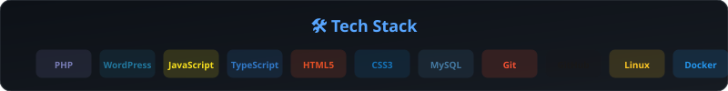

<!--
═══════════════════════════════════════════════════════════════
  M. FARHAN HAMIM — GitHub Profile README
  CEO @ PSBDx · WordPress Plugin Developer · Open‑Source Contributor
  * 100% Self-Hosted SVGs generated by Python. Zero 3rd party dependencies. *
═══════════════════════════════════════════════════════════════
-->

<!-- SECTION 1 — HERO BANNER -->

  
  

<!-- SECTION 2 — ABOUT ME -->

  

<h2 align="center">⚡ About Me</h2>

  I'm <strong>M. Farhan Hamim</strong> — the CEO of <strong>PSBDx</strong>, a product studio building
  high‑quality WordPress plugins and digital tools. I believe software should feel
  <em>invisible</em> — it should just work, beautifully.

  My work lives at the intersection of <strong>plugin architecture</strong>,
  <strong>user experience</strong>, and <strong>open‑source contribution</strong>.
  When I'm not shipping releases, you'll find me translating WordPress into new
  languages or mentoring developers on the WordPress.org forums.

 

  

 

<!-- SECTION 3 — TECH STACK -->

  

<h2 align="center">🛠️ Tech Stack</h2>

  

 

<!-- SECTION 4 — GITHUB ANALYTICS -->

  

<h2 align="center">📊 GitHub Analytics</h2>

  
    
  
    
  

 

<!-- SECTION 5 — DYNAMIC ACTIVITY -->

  

<h2 align="center">⚡ Dynamic Activity</h2>

  

 

<!-- SECTION 6 — TOP STARRED REPOSITORIES -->

  

<h2 align="center">⭐ Top Starred Repositories</h2>

  

 

<!-- SECTION 7 — CURRENT FOCUS -->

  

<h2 align="center">🎯 Current Focus</h2>

| 🚀 Building | 📚 Learning | 🤝 Contributing |
| :---: | :---: | :---: |
| Scaling **NetShield DNS Resolver** for enterprise networks | Advanced React patterns for **PSRM Forms App** | More translations for the WordPress **Polyglots** team |
| Enhancing **PSBDx-SVN** with automated tagging | Electron best practices for **DevBrowser** | Mentoring new plugin developers on WP.org forums |
| Expanding WooCommerce integrations for **PSBDx** | Modern PHP 8+ features for plugin architecture | Open-sourcing internal PSBDx dev tools |

 

<!-- SECTION 8 — FEATURED PROJECTS -->

  

<h2 align="center">🚀 Featured Projects</h2>

A curated selection of the tools, plugins, and applications we've built at <strong>PSBDx</strong>.

 

<table align="center" width="95%">
  <tr>
    <td width="70%" valign="top">
      <h3>🛡️ <a href="https://github.com/m-farhan-hamim/NetShield-DNS-Resolver-by-PSBDx">NetShield DNS Resolver</a></h3>
      
A powerful <strong>local DNS resolver</strong>, ad/tracker sinkhole, and real-time traffic monitor for Android. Blocks ads, trackers, and malicious domains at the DNS level.

      
🟢 Android | ☕ Java | 🌐 DNS | 📦 F-Droid

    </td>
    <td width="30%" align="center">
      <a href="https://github.com/m-farhan-hamim/NetShield-DNS-Resolver-by-PSBDx">🔗 View Repo</a>
    </td>
  </tr>
</table>

<table align="center" width="95%">
  <tr>
    <td width="70%" valign="top">
      <h3>📦 <a href="https://github.com/m-farhan-hamim/PSBDx-SVN">PSBDx-SVN</a></h3>
      
A comprehensive <strong>SVN repository manager</strong> for WordPress developers. Streamlines committing to the WordPress.org SVN repository, managing tags, branches, and trunk directories.

      
🔵 WordPress | 🐘 PHP | 💻 CLI

    </td>
    <td width="30%" align="center">
      <a href="https://github.com/m-farhan-hamim/PSBDx-SVN">🔗 View Repo</a>
    </td>
  </tr>
</table>

<table align="center" width="95%">
  <tr>
    <td width="70%" valign="top">
      <h3>🌐 <a href="https://github.com/m-farhan-hamim/PSBDx-DevBrowser">PSBDx DevBrowser</a></h3>
      
A minimal, distraction-free <strong>web browser built for developers</strong>. Features minimal controls, a focus mode, and quick access to developer tools.

      
⚛️ Electron | 🟨 JavaScript

    </td>
    <td width="30%" align="center">
      <a href="https://github.com/m-farhan-hamim/PSBDx-DevBrowser">🔗 View Repo</a>
    </td>
  </tr>
</table>

<table align="center" width="95%">
  <tr>
    <td width="70%" valign="top">
      <h3>📋 <a href="https://github.com/m-farhan-hamim/PSRM-Forms-App">PSRM Forms App</a></h3>
      
A powerful <strong>drag-and-drop form builder</strong> companion for the PSBDx Smart Report Management system. Create custom report forms with ten field types and per-form rate limiting.

      
⚛️ React | 🟢 Node.js

    </td>
    <td width="30%" align="center">
      <a href="https://github.com/m-farhan-hamim/PSRM-Forms-App">🔗 View Repo</a>
    </td>
  </tr>
</table>
 

<!-- SECTION 9 — WORDPRESS CONTRIBUTIONS & ORCID -->

  

<h2 align="center">🌐 WordPress.org Contributions</h2>

  
  
Actively contributing to the Polyglots team — making WordPress accessible in more languages, one string at a time.

 

<!-- SECTION 10 — ORCID -->

  

<h2 align="center">🔬 ORCID Profile</h2>

  

 

<!-- SECTION 11 — DEV QUOTE -->

  

<h2 align="center">💭 Words I Live By</h2>

  <blockquote>
    
<i>"Simplicity is the ultimate sophistication. It takes a lot of hard work to make something simple, to truly understand the underlying challenges and come up with elegant solutions."</i>

    
— <strong>Leonardo da Vinci</strong>

  </blockquote>
   
  <blockquote>
    
<i>"Programs must be written for people to read, and only incidentally for machines to execute. The computer is incredibly fast, accurate, and stupid. Man is unbelievably slow, inaccurate, and brilliant. The marriage of the two is a force beyond calculation."</i>

    
— <strong>Harold Abelson</strong>

  </blockquote>

 

<!-- SECTION 12 — CONNECT -->

  

<h2 align="center">🤝 Let's Connect</h2>

  
    
  
<strong>Let's build something amazing together.</strong>

   
  

